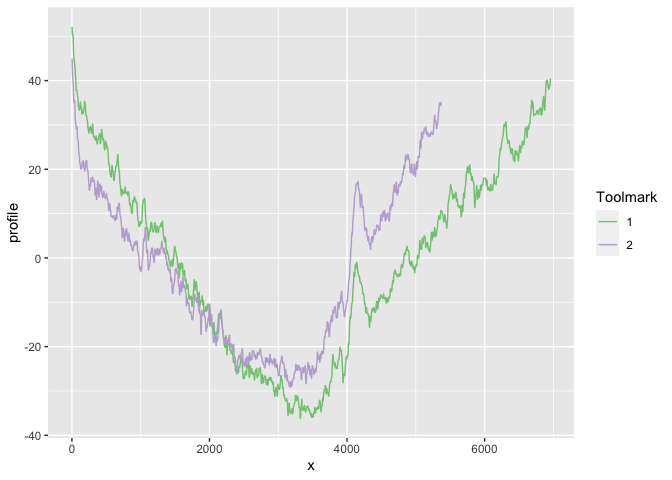

Were two striation marks made by the same tool or by different tools? The R package toolmaRk provides a range of statistical tests for that.

[](https://cran.r-project.org/package=toolmaRk) [](http://www.r-pkg.org/pkg/toolmaRk) 

[](https://travis-ci.org/jrhadler/toolmaRk)


# Installation

`toolmaRk` is available from CRAN:


```r
install.packages("toolmaRk")
```


The development version of `toolmaRk` is available from Github:


```r
# install.packages("devtools")
devtools::install_github("jrhadler/toolmaRk", build_vignettes = TRUE)
```

# Getting Started

Load the library


```r
library(toolmaRk)
```

## Load a dataset 

The `ameslab` dataset provided with the package is data collected by Prof. Scott Chumbley, Mr. Stephen Davis, Ms. Taylor Grieve, Mr. Ryan Spotts, and Dr. Jeremy Hadler (Ames Laboratory, US DoE, Contract No. DE-Ac02-07CH11358). The data consists of 16 profiles from 7 different tool (T2, T4, T6, T7, T9, T10, and T11). Profiles from the same tool are considered to be same-source, profiles from different tools are different-source marks.


```r
data("ameslab")
```

## A first look at toolmark profiles


```r
library(tidyverse)
```

```
## ── Attaching packages ────────────────────────────────── tidyverse 1.2.1 ──
```

```
## ✔ ggplot2 3.2.0.9000     ✔ readr   1.3.1     
## ✔ tibble  2.1.3          ✔ purrr   0.3.2     
## ✔ tidyr   0.8.3          ✔ stringr 1.4.0     
## ✔ ggplot2 3.2.0.9000     ✔ forcats 0.4.0
```

```
## ── Conflicts ───────────────────────────────────── tidyverse_conflicts() ──
## ✖ dplyr::filter() masks stats::filter()
## ✖ dplyr::lag()    masks stats::lag()
```

```r
library(tidyr)
ameslab$id <- 1:nrow(ameslab)
ameslab <- ameslab %>% 
  mutate(
    data = profile %>% purrr::map(.f = function(x) {
      names(x) <- "profile"
      x$x <- 1:nrow(x)
      x
  }))

ameslab_long <- ameslab %>% unnest(data) 

ameslab_long %>% 
  filter(ID=="T10", side == "A", angle==50) %>%
  ggplot(aes(x = x, y = profile)) +
  geom_line(aes(colour = factor(id))) +
  scale_colour_brewer(name="Toolmark", type="qual")
```

<!-- -->

The profiles of the two tools look very similar. We can now test for same-sourceness.

## Testing same-sourceness

The tests in `toolmaRk` are set up using the null hypothesis of different source, i.e. the basic assumption is that two profiles were made by  different tools. The alternative hypothesis is therefore 'same tool'. 

Using a non-random Chumbley score (Hadler and Morris, 2017):


```r
chumbley_non_random(
  data.frame(ameslab$profile[[1]][1:2000,]), 
  data.frame(ameslab$profile[[2]][1:2000,]))
```

```
## $same_shift_n
## [1] 28
## 
## $diff_shift_n
## [1] 24
## 
## $U
## [1] 3.340715
## 
## $p_value
## [1] 0.0004178146
```

The p-value of 0.0004 is very indicative of rejecting different-source (null hypothesis) in favor of same-source (alternative hypothesis).


# References

+ Hadler J. R. and Morris M.D., An Improved Version of a Tool Mark Comparison Algorithm. J Forensic Sci, 2017,  vol. 63 (3), 2 pp. 849-855.
http://doi.wiley.com/10.1111/1556-4029.13640
+ Hadler, J. R., Forensic tool mark comparisons: Tests for the null hypothesis of different sources, Graduate Theses and Dissertations, Iowa State University, 2017, https://lib.dr.iastate.edu/etd/15312/
